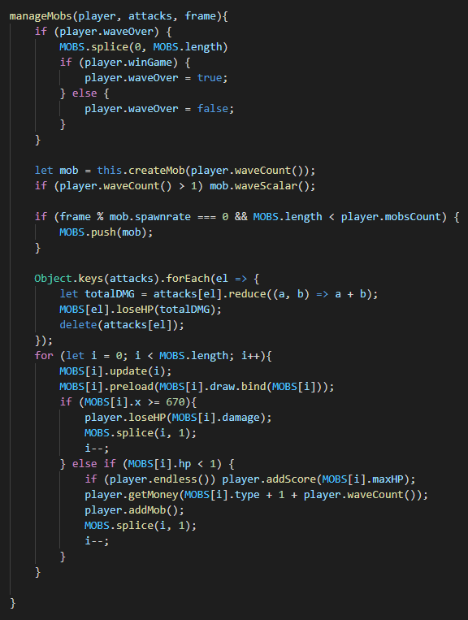
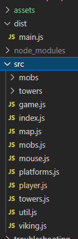

# Defend the Realm

## Live Demo

--------------------------------------------------------------------------------------------------------------------------

[Live link](https://yuhmanashi.github.io/Defend_the_Realm/)

## Background

--------------------------------------------------------------------------------------------------------------------

The idea behind a typical 'tower defense' game is that players will build towers to defend against incoming waves/hordes of enemies every round. Enemies will generate at a defined starting point and try to reach a defined endpoint along a specified path. Along this path, players will build towers which will attack enemies and keep them from reaching the endpoint. Towers can be placed in defined areas, and the player is to strategically place the towers to best defend against incoming enemies. The enemies will have health points, which are reduced with tower attacks, and will despawn when their health points reach 0.

Players will have money which is spent to buy new towers and upgrade towers. Players will also have health points, which will drop whenever an enemy passes through and reaches the endpoint. The game ends when the player's health points reaches 0. 

## Instructions

--------------------------------------------------------------------------------------------------------------------

The game has 2 modes currently, a classic mode and an endless mode.
The rules are the same, the only difference being that classic mode ends in a set amount of waves
and endless is where you try to survive as long as you can.
The goal of the game is to not lose all of your HP.
You lose HP when an enemy gets past your towers.
The game begins on wave 1 and the player has a set amount of starting gold to buy towers with.
Gold is earned by killing enemies. 
Buy towers buy clicking the bottom right and then clicking on the platform.
If you misclick you will have to click on the tower again at the bottom right.
Line up your towers however you wish.
Strategize the best set up to get you to the end of the game or as far as you can.

## Technologies, Libraries, APIs

--------------------------------------------------------------------------------------------------------------------

The following technologies were used for this project:

- ***Canvas API***: rendering the board
- ***Webpack***: bundling and transpiling JavaScript code
- ***npm***: managing project dependencies

## Implementation Details

--------------------------------------------------------------------------------------------------------------------

Below is an example of how I implemented the logic for enemies. The function accepts a player class, an array of "attacks" which refers to an array of keys corresponding to enemy id and the damage they will take, and the gameframe. I decided to first check to see if a wave is considered over, or when the amount of enemies killed reaches a certain amount, and if so, I reset the MOBS array which contains all the mobs currently on the board. Then it checks to see if the player has "won".
Everything else is to create a mob, push it into the MOBS array, then work out the rest of the logic in terms of updating their stats and drawing them onto the board. Also updates the player's stats.

## Future Features

--------------------------------------------------------------------------------------------------------------------
- Adding the option to upgrade towers,
- Adding more towers and mobs,
- Adding a variety of maps,
- Adding more modes,
- Adding another aspect to game (eg. offer boons to players at the start of each round).
- Fixing the flickering screen

## File Structure

--------------------------------------------------------------------------------------------------

